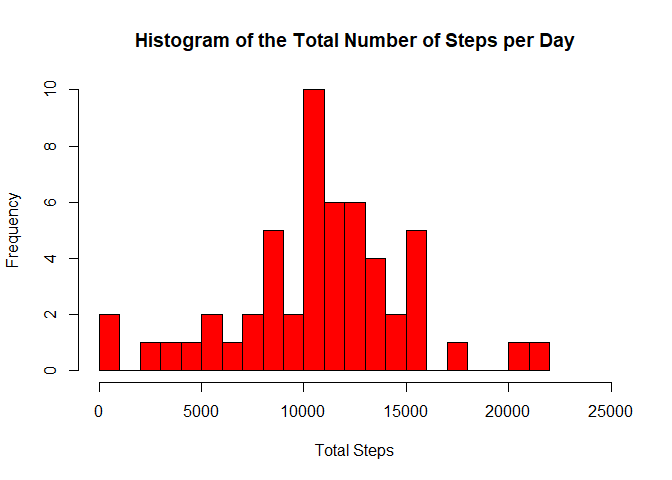
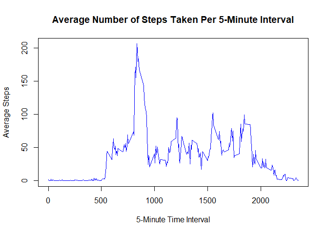
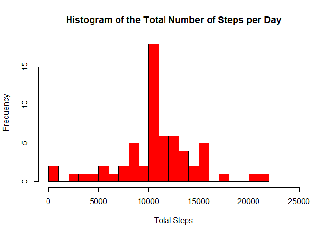
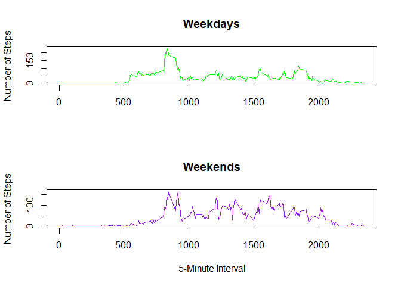

## Loading and preprocessing the data
read.csv was used in order to load in the data from activity.csv. Another dataset was made without the NA values for certain data analysis steps


```r
##read in the data from the csv file
rawdata <- read.csv("activity.csv")

##get rid of NA data
NoNAdata <- na.omit(rawdata)
```

## What is mean total number of steps taken per day?
The aggregate function was used to find the total number of steps taken per day. NA values were ignored for this analysis.

```r
DailySteps <- aggregate(NoNAdata["steps"],by = NoNAdata["date"],sum)
```

The data from the prior step was then used to create a histogram of the the total number of steps per day.
<center>

```r
hist(DailySteps$steps, col="red",xlab = "Total Steps", main = "Histogram of the Total Number of Steps per Day", breaks = 20,xlim = c(0,25000))
```

<!-- -->
</center>

In order to find the mean and the median of the total number of steps taken per day, the summary function was used.

```r
summary(DailySteps)
```

```
##      date               steps      
##  Length:53          Min.   :   41  
##  Class :character   1st Qu.: 8841  
##  Mode  :character   Median :10765  
##                     Mean   :10766  
##                     3rd Qu.:13294  
##                     Max.   :21194
```
The mean is 10766 steps and the median is 10765 steps.

## What is the average daily activity pattern?
The aggregate function was used yet again in order to find the average steps during each activity interval.

```r
##find mean steps by five minute interval
IntervalMean <- aggregate(NoNAdata["steps"], by = NoNAdata["interval"], mean)
```
This data was used to make the following time series plot
<center>

```r
plot(IntervalMean$interval, IntervalMean$steps, type = "l", main = "Average Number of Steps Taken Per 5-Minute Interval",
     col = "blue", xlab = "5-Minute Time Interval", ylab = "Average Steps")
```

<!-- -->
</center>
The highest average steps taken is 206.17 steps and the corresponding 5-minute interval is 835.

```r
maxsteps <- max(IntervalMean$steps)

rownum <- grep(maxsteps, IntervalMean$steps)

maxint <- IntervalMean$interval[rownum]
print(maxsteps)
```

```
## [1] 206.1698
```

```r
print(maxint)
```

```
## [1] 835
```

## Imputing missing values
Summing the results of the is.na function can let us find the total number of missing values in the data set.

```r
sum(is.na(rawdata))
```

```
## [1] 2304
```
Our strategy for filling in missing values will be to take the average number of steps for that time interval across all days and filling it in for the missing value. These values can be found in the IntervalMean data set from earlier.

```r
##separating the NA values
navalues <- rawdata[is.na(rawdata),]
NoNAdata <- na.omit(rawdata)

##replacing the NA values
navalues$steps <- IntervalMean$steps

##merging non-NA values with replaced NA values to recreate the original dataset
MergedData <- rbind(NoNAdata,navalues)
```
This data can be used to calculate new  total steps per day and calculate a new mean and median.

```r
##calculate new daily totals
FullDailySteps <- aggregate(MergedData["steps"], by = MergedData["date"], sum)
```

<center>

```r
##histogram of the data
hist(FullDailySteps$steps, col="red",xlab = "Total Steps", 
     main = "Histogram of the Total Number of Steps per Day", breaks = 20,xlim = c(0,25000))
```

<!-- -->
</center>
Compared to the old histogram, the center pillar is significantly higher.

```r
##calculate new mean and medians
summary(FullDailySteps)
```

```
##      date               steps      
##  Length:61          Min.   :   41  
##  Class :character   1st Qu.: 9819  
##  Mode  :character   Median :10766  
##                     Mean   :10766  
##                     3rd Qu.:12811  
##                     Max.   :21194
```
The mean stayed the same at 10766 while the median changed from 10765 to 10766.

## Are there differences in activity patterns between weekdays and weekends?
The days of the week needed to be determined for each of the days using the weekdays function.

```r
MergedData$weekday <- weekdays(as.Date(MergedData$date))
```
After that, a function to convert those days of the week into "weekday" and "Weekend" was written and performed on the data.

```r
##function to categorize as weekday or weekend
isweekday <- function(i){
      if(i  == "Saturday" | i == "Sunday"){
            i <- "Weekend"
      }
      else{
            i <- "Weekday"
      }
}

##Replace the actual weekday values with "Weekend" or "Weekday"
MergedData$weekday <- tapply(MergedData$weekday,INDEX = 1:17568 ,FUN = isweekday)
```
This data was then separated into weekday and weekend and the steps were averaged per time interval.

```r
##separate Weekday and Weekend
StepsWeekdays <- MergedData[MergedData$weekday == "Weekday",]
StepsWeekends <- MergedData[MergedData$weekday == "Weekend", ]

##average both data sets by individual time intervals
AggregatedWeekdays <- round(aggregate(StepsWeekdays["steps"],by = StepsWeekdays["interval"], mean), digits = 4)
AggregatedWeekends <-  round(aggregate(StepsWeekends["steps"], by = StepsWeekends["interval"], mean), digits = 4)
```
The difference in average steps can be seen in the following graphs.
<center>

```r
par(mfrow = c(2,1))
plot(AggregatedWeekdays, type = "l",main = "Weekdays", ylab = "Number of Steps", xlab = NA, col = "green")
plot(AggregatedWeekends, type = "l",main = "Weekends", ylab = "Number of Steps", xlab = "5-Minute Interval", col = "purple")
```

<!-- -->
</center>
The activity paterns are clearly different between weekends and weekdays.
